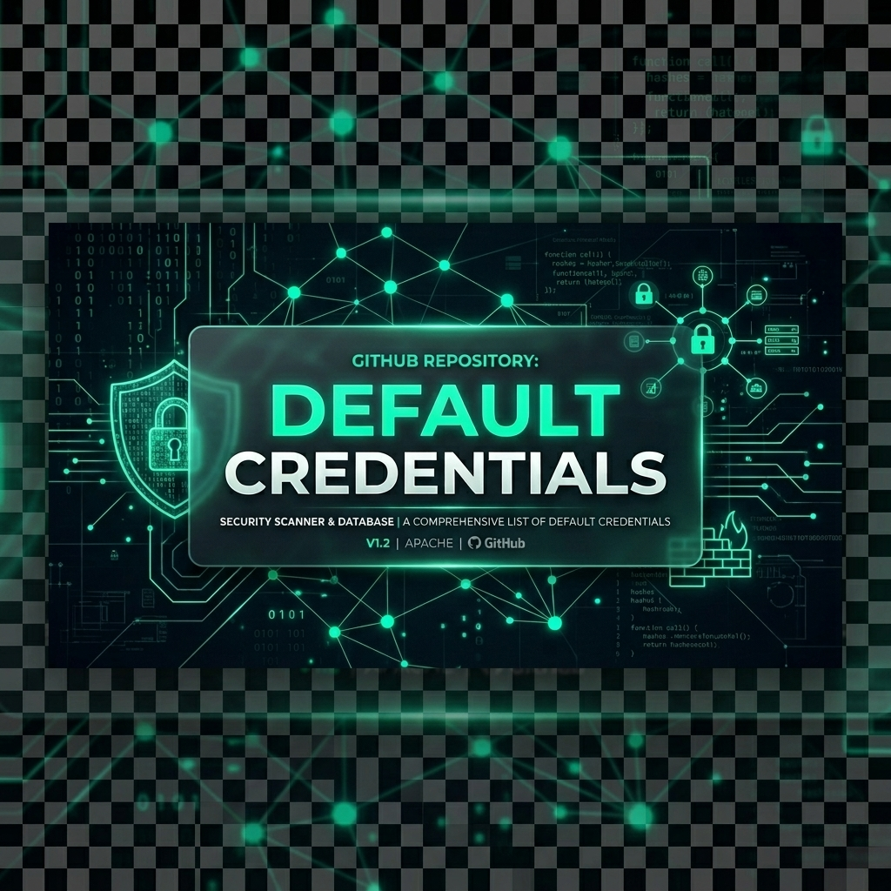

# 🛡️ Default Credentials Database / Base de Credenciales por Defecto
**A modern, fast and offensive security tool for default device credentials.**
**Una herramienta moderna, rápida y de seguridad ofensiva para credenciales por defecto de dispositivos.**

-red?style=for-the-badge)

 

  

[🇪🇸 Español](#-español) | [🇬🇧 English](#-english)

---

## 🇪🇸 Español

### 🚀 Sobre el Proyecto
Este repositorio contiene la evolución completa del proyecto **DefaultCreds (Base de Credenciales por Defecto)**, una herramienta web diseñada para buscar credenciales de fábrica en diferentes dispositivos y servicios (Rutas, Routers, Servidores, etc.). Ideal tanto para equipos de Red Team (Seguridad Ofensiva) como Blue Team (Seguridad Defensiva). El proyecto ha escalado desde una simple interfaz HTML+JS con base de datos NoSQL, hacia un entorno robusto utilizando el bundler moderno Vite.

### ⚠️ Configuración de Credenciales (IMPORTANTE)
**Este proyecto NO incluye las credenciales reales de conexión a la base de datos de Firebase.**
Si vas a clonarlo y montarlo en tu propio entorno:
* Tienes que configurar las variables  `firebaseConfig` utilizando tus propias claves de la API de Firebase y Firestore, ya que las credenciales originales han sido aseguradas, sanitizadas, o dejadas como "placeholders" genéricos.

### 📜 Historial de Versiones y Cambios (Changelog)

* **🔖 v1.0 (Lanzamiento Inicial):**
  * Página web estándar y puramente construida con HTML, Tailwind CSS y JavaScript Vanilla.
  * Conexión directa con Firebase en el "Frontend", permitiendo consultar en tiempo real las credenciales por riesgo (CRÍTICO, ALTO, MEDIO).
  * Interfaz de una sola página más guía rápida.
  * Funcionalidad de *clipboard* (copiado al portapapeles) para agilizar las pruebas de penetración.
* **🚀 v2.0 (Despliegue y Modernización - Vite + Modular):**
  * El ecosistema completo se refactorizó usando **Vite** como empaquetador moderno (`bundler` y servidor de desarrollo).
  * Inclusión de soporte Node.js, `npm` con dependencias preconfiguradas (`package.json`) y dependencias para Tailwind y PostCSS para una integración avanzada.
  * Compresión y optimización de archivos (assets estáticos y públicos pre-procesados y listos para un despliegue optimizado en la carpeta `dist/`).
  * Estructura ideal para mantenimiento a largo plazo y mejor experiencia de desarrollo continuo (DX - Developer Experience).

### ⚖️ Licencia y Uso
Este proyecto **NO es de código abierto (Open Source)**.
Los archivos están disponibles en GitHub únicamente en forma de "solo lectura" (Read-only) para demostrar las habilidades, la innovación en herramientas de ciberseguridad, y como portfolio profesional. Puedes mirarlo y aprender de la arquitectura, pero **no** se otorgan permisos ni licencia para modificar, re-distribuir, hostear en dominios propios sin autorización o sacar provecho económico (Copyright / All Rights Reserved).

---

  

## 🇬🇧 English

### 🚀 About the Project
This repository hosts the evolution of the **DefaultCreds (Default Credentials Database)** project. A web tool developed for finding out-of-the-box (default) credentials across different devices and systems (Routers, Switches, Servers, IoT). Designed for both Red Team (Offensive Security) and Blue Team (Defensive Security) operations. The project scaled from a fundamental HTML+JS interface backed by a NoSQL database into a robust ecosystem leveraging the modern Vite bundler.

### ⚠️ API & Database Configuration (IMPORTANT)
**This repository does NOT contain real production API keys or Firebase connection rules for security reasons.**
If you clone this to deploy it on your own server:
* You must replace all `firebaseConfig` object variables with your own Firebase/Firestore credentials. Original connection identifiers have been secured, sanitized or replaced with placeholders for public showcase.

### 📜 Version History & Changelog

* **🔖 v1.0 (Initial Release):**
  * Standard website built primarily with HTML, Tailwind CSS and plain Vanilla JavaScript.
  * Direct frontend Firebase connection, enabling real-time queries for credentials grouped by risk labels (CRITICAL, HIGH, MEDIUM).
  * Single Page layout features along with a remediation guide.
  * Easy to use *clipboard functionality* designed to accelerate penetration testing workflow.
* **🚀 v2.0 (Modernization & Deployment - Vite):**
  * Full ecosystem refactor integrating **Vite** as a modern build tool and dev server.
  * Node.js support added with `npm` pre-configured requirements (`package.json`), enabling an advanced Tailwind setup alongside PostCSS.
  * Automatic optimization and asset compression ready for fast production deployments inside a native structured `dist/` build.
  * Long-term maintainable skeleton crafted focusing on Developer Experience (DX).

### ⚖️ License and Usage Terms
This project is **NOT Open Source**.
The source code provided in this repository is purely strictly "read-only" to demonstrate programming skills, innovation in cybersecurity tools context, and for portfolio showcase purposes. You may browse and learn from the architecture, however, **no explicit license is granted** to modify, re-distribute, re-host under external domains, or utilize for commercial purposes without explicit prior authorization (Copyright / All Rights Reserved).
